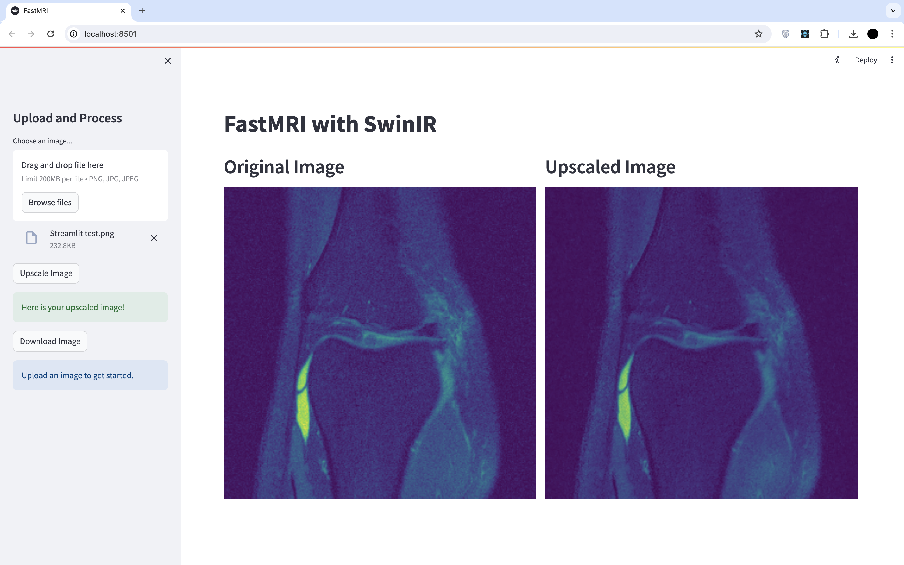

# FastMRI with SwinIR

## Getting Started

- Clone the repositiory.
- Run "streamlit run dashboard.py".
- Upload and low resolution MRI image to upscale.

&nbsp;

## Finetuning

### Dataset
Download additional dataset from https://fastmri.med.nyu.edu and save the file in the h5datafiles folder.

### Training

- Run Data_collection.ipynb and new data would be appended to data in the dataset folder.

- Run SwinIR_Train.ipynb file in google colab or any other eviroment. 
